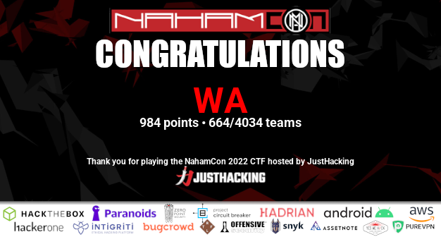

# Nahamcon CTF 2022

Writeups for Nahamcon CTF 2022: [NahamCon](https://ctf.nahamcon.com/)

<strong>April 28th, 12:00 PM PST - April 30th, 12:00 PM PST</strong>

(48-Hour Competition)

## Categories

- Crypto/Stego
   - [50] [Unimod](cryptography/unimod/README.md)
   
- Pwn/Binary Exploitation
   - [50] [Babiersteps](binary_exploitation/babiersteps/README.md)

- Miscellaneous
   - [50] [EXtravagant](web/extravagant/README.md)
   - [50] [Jurassic Park](web/jurassic_park/README.md)
   - [50] [Personnel](web/personnel/README.md)

## Results

I decided to create a team named "WA" for this challenge. The team consists of:
 - [s3ansh33p](https://github.com/s3ansh33p)
 - Elk

Collectively, we captured a total of 21 flags, resulting in a score of 984.
You can view team the results [here](https://ctf.nahamcon.com/teams/929). 

